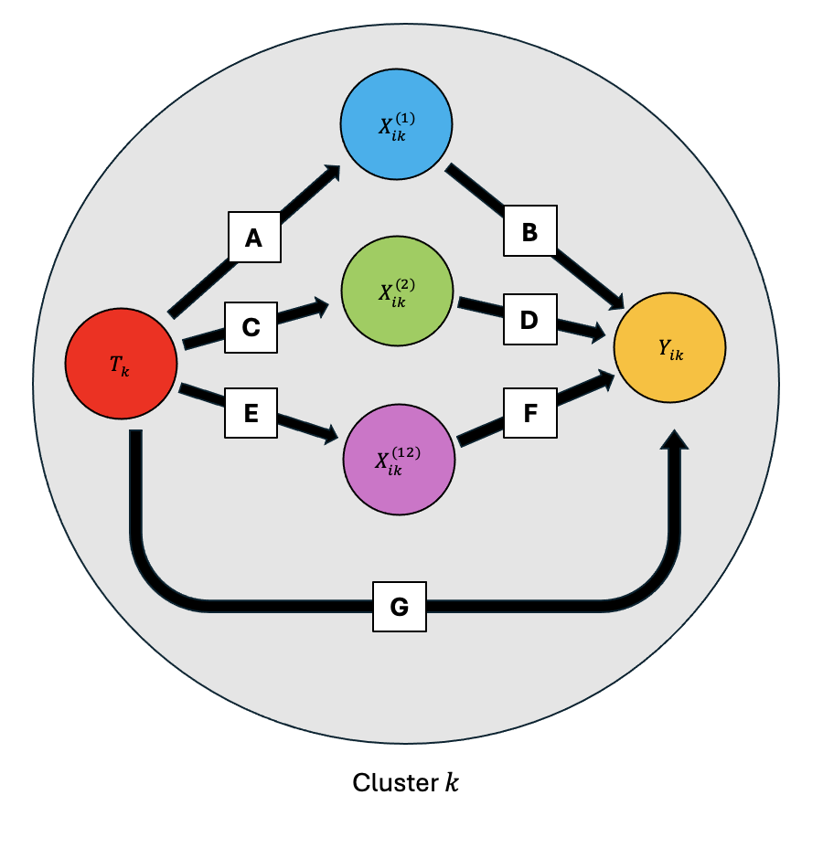
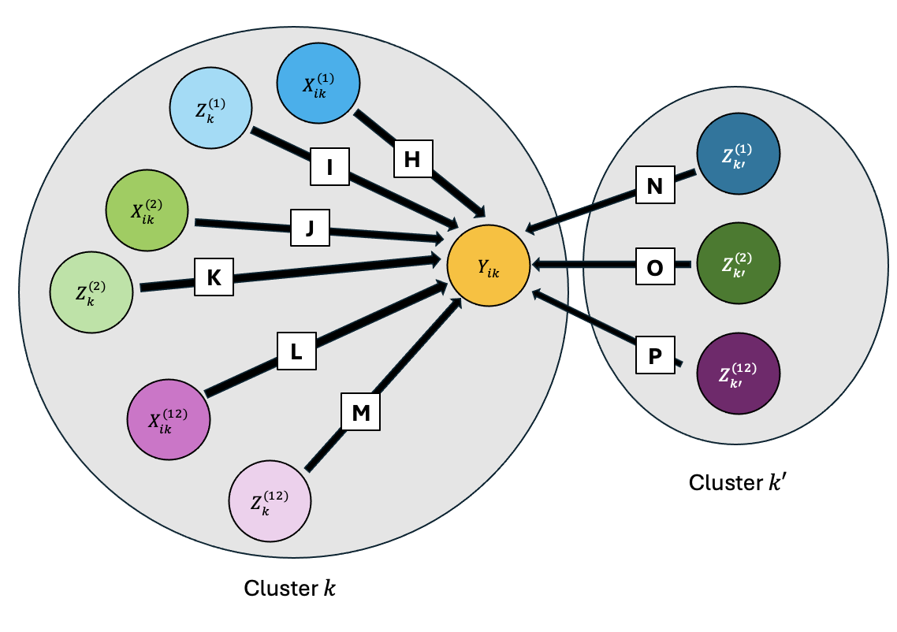
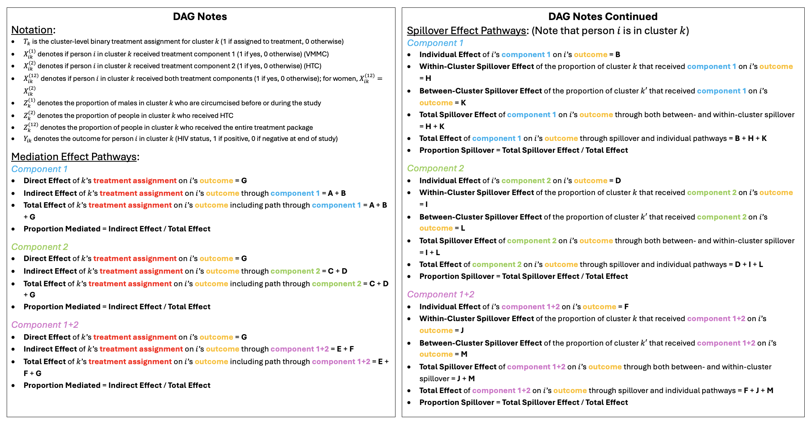
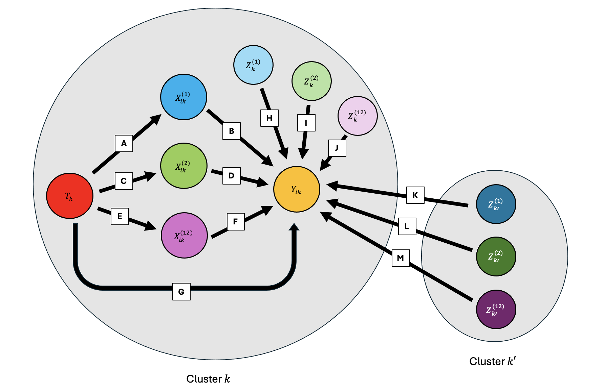

## Questions of Interest

1. What is the overall effect (OR) of CP on HIV incidence?

    a. Use a logistic regression model
    b. Intent to treat (ITT) analysis
  
2. To what extent is the overall effect mediated by VMMC (Voluntary Male Medical Circumcision)? 

    a. In this case, "overall" means combining spillover effects with individual effects
    b. Define the mediation proportion
  
3. What is the individual effect (OR) of the CP intervention?

    a. This is the individual effect among those to intervention villages
    b. Will be a standard mediation analysis
    c. Related: To what extent is the individual effect mediated by receipt of VMMC? Look at the mediation proportion in a standard mediation analysis.
    
4. To what extent is the individual effect of CP mediated by VMMC?
  
5. What is the spillover effect (OR) of CP in intervention villages compared to those who did not take up CP?

    a. Spillover effect is among those in intervention villages who did not receive the intervention
    b. Related: To what extent is the spillover effect mediated by villages level VMMC deliver (mediation proportion)? (Look at Tyler's paper)
  
6. What is the total spillover (OR) of the CP intervention?

    a. Total spillover effect is everyone in BCPP who did not receive the intervention in control and intervention villages
    b. Related: To what extent is the total spillover effect mediated by village level of VMMC delivery (mediation proportion)?
    
7. What is the total effect of CP across all villages in the study?

# DAGS
## Mediation DAG

This DAG shows the causal pathways between the treatment assignment, actual treatment components received (mediator), and the outcome for a given individual $i$ in cluster $k$. 

\underline{Effect Pathways}:

- **Pathways for Component 1**

  - *Direct Effect* of $k$'s treatment assignment on $i$'s outcome = **G**
  
  - *Indirect Effect* of $k$'s treatment assignment on $i$'s outcome through component 1 = **A** + **B**
  
  - *Total Effect* of $k$'s treatment assignment on $i$'s outcome including path through component 1 = **A** + **B** + **G**
  
  - *Proportion Mediated* = Indirect Effect / Total Effect

- **Pathways for Component 2**

  - *Direct Effect* of $k$'s treatment assignment on $i$'s outcome = **G**
  
  - *Indirect Effect* of $k$'s treatment assignment on $i$'s outcome through component 2 = **C** + **D**
  
  - *Total Effect* of $k$'s treatment assignment on $i$'s outcome including path through component 2 = **C** + **D** + **G**
  
  - *Proportion Mediated* = Indirect Effect / Total Effect

- **Pathways for Components 1+2**

  - *Direct Effect* of $k$'s treatment assignment on $i$'s outcome = **G**
  
  - *Indirect Effect* of $k$'s treatment assignment on $i$'s outcome through component 1+2 = **E** + **F**
  
  - *Total Effect* of $k$'s treatment assignment on $i$'s outcome including path through component 1 = **E** + **F** + **G**
  
  - *Proportion Mediated* = Indirect Effect / Total Effect
  
  
```{r, echo=FALSE, out.width="60%", fig.align='center', results='asis'}

```

\newpage

## Between and Within Cluster Spillover DAG

\underline{Effect Pathways}:

- **Pathways for Component 1**

  - *Individual Effect* of $i$'s component 1 on $i$'s outcome = **H**
  
  - *Within-Cluster Spillover Effect* of the proportion of cluster $k$ that received component 1 on $i$'s outcome = **I**
  
  - *Between-Cluster Spillover Effect* of the proportion of cluster $k'$ that received component 1 on $i$'s outcome = **N**
  
  - *Total Spillover Effect* of component 1 on $i$'s outcome through both between- and within-cluster spillover = **I** + **N**
  
  - *Total Effect* of component 1 on $i$'s outcome through spillover and individual pathways = **H** + **I** + **N**
  
  - *Proportion Spillover* = Total Spillover Effect / Total Effect

- **Pathways for Component 2**

  - *Individual Effect* of $i$'s component 2 on $i$'s outcome = **J**
  
  - *Within-Cluster Spillover Effect* of the proportion of cluster $k$ that received component 2 on $i$'s outcome = **K**
  
  - *Between-Cluster Spillover Effect* of the proportion of cluster $k'$ that received component 2 on $i$'s outcome = **O**
  
  - *Total Spillover Effect* of component 2 on $i$'s outcome through both between- and within-cluster spillover = **K** + **O**
  
  - *Total Effect* of component 2 on $i$'s outcome through spillover and individual pathways = **J** + **K** + **O**
  
  - *Proportion Spillover* = Total Spillover Effect / Total Effect

- **Pathways for Components 1+2**

  - *Individual Effect* of $i$'s component 1+2 on $i$'s outcome = **L**
  
  - *Within-Cluster Spillover Effect* of the proportion of cluster $k$ that received component 1 on $i$'s outcome = **M**
  
  - *Between-Cluster Spillover Effect* of the proportion of cluster $k'$ that received component 1 on $i$'s outcome = **P**
  
  - *Total Spillover Effect* of component 1 on $i$'s outcome through both between- and within-cluster spillover = **M** + **P**
  
  - *Total Effect* of component 1 on $i$'s outcome through spillover and individual pathways = **L** + **M** + **P**
  
  - *Proportion Spillover* = Total Spillover Effect / Total Effect

```{r, echo=FALSE, out.width="80%", fig.align='center', results='asis'}

```


```{r setup, include=FALSE}
knitr::opts_chunk$set(echo = TRUE)
```

```{r, echo = FALSE}
# Looking at death days
death_dat <- dat1 %>%
  dplyr::select(de_subj_idC, # Subject identifier
                               community, # Community identifier
                               
                               random_arm, # Randomization arm (Treatment Assignment)
                               gender, # Gender
                               
                               # At start of study? Unclear
                               hiv_status_current, # Current HIV status
                               circumcised, # Male circumcision
                               
                               # "Coverage Endpoint"
                               endpoint_coverage_htc, # Coverage endpoint: HIV-tested or diagnosed HIV+
                               endpoint_coverage_mc, # Coverage endpoint: male circumcision
                               
                               
                               # Outcome
                               endpoint_seroconvert, death_primary_cause, death_group_cause)

# tally(~ death_group_cause, data = death_dat)
# tally(~ death_primary_cause, data = death_dat)
# 
# tally(death_primary_cause ~ death_group_cause, data = death_dat)
# 
# tally(death_primary_cause ~ endpoint_seroconvert, data = death_dat)
# tally(death_group_cause ~ endpoint_seroconvert, data = death_dat)
```


## Male Circumcision Characteristics

Below shows more characteristics of male circumcision. 

```{r creating_table2, echo = FALSE}
table2_cleanDat <- table1(~ hiv_status_current + 
                            endpoint_coverage_htc + 
                            endpoint_seroconvert | endpoint_coverage_mc, 
                          data = mutate(cleanDat, 
                                        endpoint_coverage_mc = ifelse(is.na(endpoint_coverage_mc), "Missing", endpoint_coverage_mc)))
table2_cleanDat
```

\newpage

## Gender Characteristics

Below shows more characteristics of gender. 

```{r creating_table3, echo = FALSE}
table3_cleanDat <- table1(~ hiv_status_current + 
                            endpoint_coverage_htc + 
                            endpoint_seroconvert | gender, 
                          data = mutate(cleanDat, 
                                        gender = ifelse(is.na(gender), "Missing", gender)))
table3_cleanDat
```

\newpage

## Characteristics of Treatment Groups

Below shows Table 1 for the baseline characteristics of the BCPP dataset. All proportions are calculated using this dataset (no exclusions). Then, we exclude any individuals who start the study HIV-infected, refused HIV testing, or had missing HIV testing. We calculate the proportions of the full dataset before removing those who are HIV-infected because they are still considered a cluster-level characteristic that will affect the HIV-uninfected individuals.

```{r creating_table1, echo = FALSE}
table1_cleanDat <- table1(~cluster_size + gender + hiv_status_current + 
                            endpoint_coverage_htc + endpoint_coverage_mc + 
                            endpoint_seroconvert | random_arm, data = cleanDat)
table1_cleanDat

paste0("Excluded from the study: n = ", nrow(cleanDat) - nrow(filter(cleanDat, hiv_status_current == "HIV-uninfected")))
```

## Outcome Characteristics

Below shows more characteristics of HIV status at the end of the study. 

```{r creating_table4, echo = FALSE}
table4_cleanDat <- table1(~ gender + 
                            endpoint_coverage_mc + 
                            endpoint_coverage_htc | endpoint_seroconvert, 
                          data = mutate(cleanDat, 
                                        endpoint_seroconvert = ifelse(is.na(endpoint_seroconvert), "Missing", endpoint_seroconvert)))
table4_cleanDat
```

## Overall Baseline Characteristics


# OUTPUT TABLES

```{r, echo = FALSE}
summaryDat_exclusions <- modelDat %>%
  mutate(`Proportion of Males in One's Cluster` = male_count/cluster_size) %>%
  dplyr::select(`Treatment Group` = random_arm,
                `Cluster Size` = cluster_size,
                `Gender` = gender,
                `HIV Status at Start` = hiv_status_current,
                `Treatment Component: MC` = endpoint_coverage_mc,
                `Treatment Component: HTC` = endpoint_coverage_htc,
                `Proportion of HIV Infected in One's Cluster` = hiv_infected_prop,
                `Proportion of Males in One's Cluster`,
                `Proportion of Males Circumcised in One's Cluster` = Z1_k, 
                `Proportion HTC in One's Cluster` = Z2_k,
                `Outcome: Seroconvert` = endpoint_seroconvert) 

baseline_table1 <- table1(~ `Cluster Size` + `Gender` +
                `HIV Status at Start` + `Treatment Component: MC` +
                `Treatment Component: HTC` +
                `Outcome: Seroconvert` | `Treatment Group`, 
                          data = summaryDat)
baseline_table1

baseline_table2 <- table1(~ `Proportion of HIV Infected in One's Cluster` +
                `Proportion of Males in One's Cluster` +
                `Proportion of Males Circumcised in One's Cluster` +
                `Proportion HTC in One's Cluster`  | `Treatment Group`, 
                          data = summaryDat)
baseline_table2
```


# End of Main Analysis


# Draft of DAGs

## Potential Updated List of Questions

**Mediation Related**

1. To what extent is the direct effect of CP mediated by VMMC?

    - Paths **A** + **B** in the DAG

2. To what extent is the direct effect of CP mediated by HTC?

    - Paths **C** + **D** in the DAG

**Spillover Related**

1. To what extent does the cluster-level proportion of VMMC in one's cluster affect one's outcome? 
  
    - Path **H** in the DAG
  
    - This is looking at *within-cluster* spillover
  
2. To what extent does another cluster's proportion of VMMC affect one's outcome?

    - Path **K** in the DAG
  
    - This is looking at *between-cluster* spillover
  
    - Focus is on intervention clusters spilling over to control clusters
  
3. To what extent does the cluster-level proportion of HTC of one's cluster affect one's outcome? 
  
    - Path **I** in the DAG
  
    - This is looking at *within-cluster* spillover
  
4. To what extent does another cluster's proportion of HTC affect one's outcome?

    - Path **L** in the DAG
  
    - This is looking at *between-cluster* spillover 
  
    - Focus is on intervention clusters spilling over to control clusters

**Overall**

1. What is the total effect of VMMC on HIV seroconversion at the end of the study?

    - Paths **B** + **H** + **K** in the DAG

    - Adding up total spillover effects (both between- and within-cluster) with individual effects
  
2. What is the total effect of HTC on HIV seroconversion at the end of the study?

    - Paths **D** + **I** + **L** in the DAG

    - Adding up total spillover effects (both between- and within-cluster) with individual effects


\newpage

# DIRECTED ACYCLIC GRAPHS (DAGs)

This DAG shows both mediation pathways (i.e. pathways from treatment assignment, to actual treatment uptake, to outcome) as well as spillover (i.e. within-cluster spillover to a given individual, and between-cluster spillover to a given individual). The pathways are shown below. 

```{r, echo=FALSE, out.width="100%", fig.align='center', results='asis'}

```

```{r, echo=FALSE, out.width="100%", fig.align='center', results='asis'}

```


\newpage

## Misc. Notes

- Assume that there is no confounding or effect modification by anything including "village/cluster" and their sizes to start.
- For each of the above analyses, we can specify the causal assumptions needed for validity. It would be great to also identify the assumptions that are empirically verifiable or partially empirically verifiable.
- Once we've estimated the parameters and determined the assumptions needed for them to have a causal interpretation, and empirically verified those that we can, we can see if we have any new methodology or if this is an advanced application to existing methodology.


| Model Name | Model equation | Analytic sample | Extra covariates | What $\beta\_1$ estimates |
| ---------- | -------------- | --------------- | ---------------- | ------------------------- |
| **SpW** | $\displaystyle \operatorname{logit}(Y_{ik})=\beta_0+\beta_1 T_k$ | Untreated Individuals | none | Total spillover for untreated people  |
| **SpWR** | $\displaystyle \operatorname{logit}(Y_{ik})=\beta_0+\beta_1T_k+\beta_2 Z_k^{(1)}$ | Untreated Individuals | village MC coverage | Remaining spillover after MC-coverage path is held fixed |
| **Ind** | $\displaystyle \operatorname{logit}(Y_{ik})=\beta_0+\beta_1 T_k+\beta_2 Z_k^{(1)}+\beta_3 Z_k^{(2)}$ | Males Only | village MC & HTC coverage | Assignment effect after measured spillover is held fixed (still contains own-uptake + unmeasured spillover) |
| **IndD** | $\displaystyle \operatorname{logit}(Y_{ik})=\beta_0+\beta_1 T_k+\beta_2X_{ik}^{(1)}+\beta_3 Z_k^{(1)}+\beta_4 Z_k^{(2)}$ | Males Only | own MC $X_{ik}^{(1)}$ + $Z$’s | Controlled-direct effect (paths via own MC **and** measured spillover blocked) |
| **Overall** | $\displaystyle \operatorname{logit}(Y_{ik})=\beta_0+\beta_1T_k$ | All HIV-negative participants | none | Total impact of CP village assignment (own uptake + *all* spillover) |


\newpage

And here's a proposal of how to maybe redo this so that the models are nested, and thus we can get valid results for important estimands such as "proportion of the total effect explained by spillover". 

Steps: 

1. Work on a single dataset (e.g. all HIV-negative participants at start of study)

2. Fit nested lgoistic models so that each new model adds only one class of pathways:

| Label   | Model equation  | $\beta_1$ contains  |
| ------------------------------- | ----------------------------------------------------------------------------------------------------------------------------------------------------------------------- | --------------------------------- |
| **A.  Total effect**             | $\displaystyle \operatorname{logit}\bigl(P(Y_{ik}=1)\bigr)=\beta_0+\beta_1T_k$                                                                                   | Own uptake + **all** spillover    |
| **B.  Minus own uptake**         | $\displaystyle \operatorname{logit}\bigl(P(Y_{ik}=1)\bigr)=\beta_0+\beta_1T_k+\beta_2X_{ik}^{(1)}+\beta_3X_{ik}^{(2)}$                                       | **All spillover**                 |
| **C.  Minus measured spillover** | $\displaystyle \operatorname{logit}\bigl(P(Y_{ik}=1)\bigr)=\beta_0+\beta_1T_k+\beta_2X_{ik}^{(1)}+\beta_3X_{ik}^{(2)}+\beta_4Z_k^{(1)}+\beta_5Z_k^{(2)}$ | Residual (*unmeasured*) spillover |


3. On the log-odds scale, the proportion of the total effect explained by spillover is then

$$\frac{\beta_1^A - \beta_1^B}{\beta_1^A}$$

4. All decompositions: 

    - Own uptake contribution is $\beta_1^A - \beta_1^B$
    - Measured spillover = $\beta_1^B - \beta_1^C$
    - Unmeasured spillover = $\beta_1^C$
    - These three pieces add up exactly: $\beta_1^A = (\beta_1^A - \beta_1^B) + (\beta_1^B - \beta_1^C) + \beta_1^C$


All quantities come from the same population, so the algebra and interpretation is valid.

